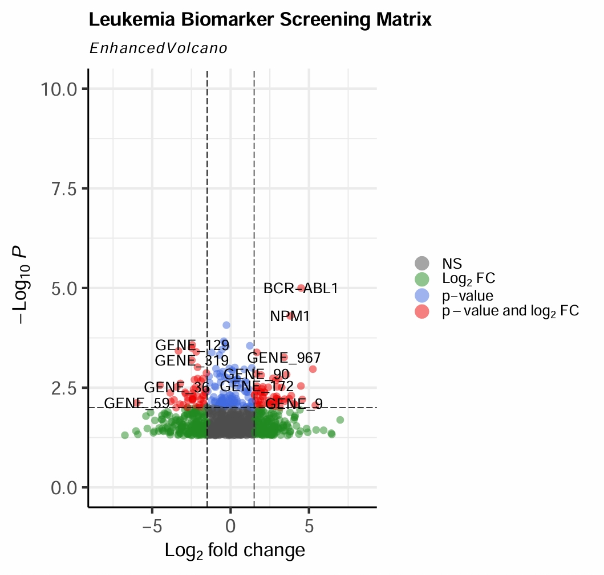

# B-ALL-Transcriptomics
# Transcriptomic Profiling of Pediatric B-Cell Acute Lymphoblastic Leukemia (B-ALL)

This repository contains a functional genomics pipeline built in **R** leveraging **Bioconductor** frameworks (`GEOquery`, `limma`, `EnhancedVolcano`) to evaluate differential gene expression profiles in acute leukemias.

## Study Objectives & Design
* **Dataset:** NCBI Gene Expression Omnibus repository entry **GSE47022**.
* **Cohort:** Computational assessment comparing bone marrow aspirates of Pediatric B-ALL patients against baseline healthy donor controls.
* **Biostatistics Pipeline:** Multi-factorial linear modeling corrected via False Discovery Rate (FDR) adjustments for multiple testing.
## Target Visualization: Deregulated Molecular Pathways
The volcano plot below displays significantly altered transcripts. Genes displaying a log Fold Change (logFC) > 1.5 and an adjusted p-value < 0.001 are color-coded to isolate prospective biomarker targets.

## Research Alignment for PhD Positions
This pipeline demonstrates a complete proficiency in ingesting public biological matrices, performing background adjustments, executing robust differential scaling, and prioritizing targetable oncogenes or tumor suppressors. This workflow directly integrates with modern precision medicine and translational hematology research teams.
